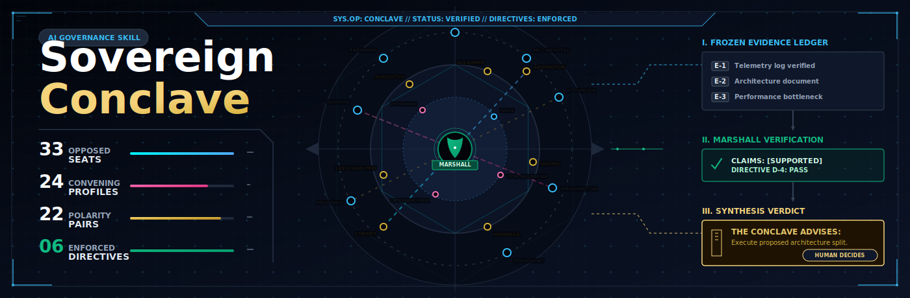

# Sovereign Conclave



**Sovereign Conclave is an evidence-grounded deliberation protocol for hard decisions.** It convenes a small set of deliberately opposed seats, forces every factual claim back to a frozen [Evidence Ledger](docs/EVIDENCE_LEDGER.md), preserves dissent, and writes a decision record that advises the human without authorizing action.

It is built for decisions where a fluent single answer is not enough: architecture calls, institutional strategy, civic-risk review, emergency preparedness, red-team war-gaming, governance tradeoffs, and high-consequence product or policy choices.

## What It Is

Sovereign Conclave is a portable skill package for Claude Code, Codex, and Antigravity.

At its core, it gives an assistant a repeatable protocol:

1. Freeze the [Evidence Ledger](docs/EVIDENCE_LEDGER.md).
2. Frame the actual decision and options.
3. Convene a small quorum from a larger seat library.
4. Run blind first-round analysis to prevent herding.
5. Cross-examine the claims.
6. Let Marshall verify support against the ledger.
7. Produce a written verdict with confidence, dissent, and what would change the recommendation.

The project currently includes:

- 33 active seats.
- 15 convening profiles.
- 21 polarity pairs.
- Structural Justice checks for evidence, rights, access, values, and dignity.
- A multi-target installer for Claude Code, Codex, and Antigravity.
- A machine-readable roster/profile config.
- A local verdict-scaffold runner.
- CI and repository validation scripts.
- Curated demo verdicts.

## What It Can Do

Use Sovereign Conclave to:

- Pressure-test a technical architecture decision.
- War-game a plan with blue/red/white cell structure.
- Review policy or governance decisions against rights, access, legitimacy, and values.
- Stress-test civic intelligence workflows, including eSiasa-style county dossier decisions.
- Evaluate pandemic or continuity-of-government preparedness plans.
- Convert messy deliberation into a durable verdict file.
- Keep unsupported factual claims visible instead of letting them pass as judgment.

It does **not** make autonomous decisions. It does **not** deploy, spend, push, execute, or authorize irreversible action. The Conclave advises; the human decides.

## Why It Is Different

Most "multi-agent council" patterns fail by becoming theater: many voices, one model, little grounding, no record of what was actually supported.

Sovereign Conclave is built around a stricter spine:

- **Evidence first:** no load-bearing factual claim without an `E#` citation.
- **Blind Round 1:** seats argue independently before seeing one another.
- **Forced dissent:** early convergence triggers a counterfactual pass.
- **Marshall always verifies:** unsupported decisive claims downgrade the verdict.
- **Seats are lenses, not capabilities:** a persona name does not grant expertise.
- **Small quorums:** 3-8 seats plus Marshall, even though the library is larger.
- **Advice only:** output is a recommendation to the human, never an action order.

## Quick Start

Validate the checkout:

```bash
python3 scripts/validate_repo.py
bash -n install.sh
./install.sh --target all --dry-run
```

Install for your tool:

```bash
./install.sh                         # Claude Code, default target
./install.sh --target codex          # Codex
./install.sh --target antigravity    # Antigravity
./install.sh --target all --dry-run  # preview every target
```

Restart the target tool after installation.

## Use In An Assistant

Use `/conclave` where slash commands are supported:

```text
/conclave Should we move the notifications service off Cloud Run?
/conclave --profile architecture Monorepo or polyrepo for the new modules?
/conclave --profile war-game Pressure-test our launch plan for next quarter.
/conclave --profile pandemic-preparedness County outbreak readiness and communications plan?
/conclave --profile esiasa-civic-stress Stress-test the new county intelligence dossier flow.
/conclave --profile oppression-audit Does this crisis plan create coercive drift?
/conclave --profile decolonization Are we missing land, dignity, or repair obligations?
/conclave --members feynman,lee-kuan-yew,aurelius Is the caching design sound?
```

Paste or attach the real artifacts before Round 1. They become the [Evidence Ledger](docs/EVIDENCE_LEDGER.md), and Marshall flags claims that are unsupported by it.

## Local Runner

The local runner is deterministic. It selects seats from `configs/conclave-roster.json` and creates a verdict scaffold. It does not call model providers and does not synthesize claims.

```bash
bin/conclave --list-profiles
bin/conclave --profile pandemic-preparedness --dry-run "County outbreak readiness plan"
bin/conclave --profile architecture --stdout "Move notifications off Cloud Run?"
bin/conclave --profile risk --evidence-file README.md --evidence-note "Rollback plan is pending owner approval." --stdout "Can this release go out?"
```

Generated local verdicts go to `verdicts/`, which is ignored by git except for `.gitkeep` because verdicts may contain sensitive evidence.

## Profiles

| Profile | Use For |
| --- | --- |
| `architecture` | Code, system design, platform, or irreversible technical capability calls |
| `strategy` | Competitive, directional, timing, and commitment decisions |
| `risk` | Downside, safety, security, rights, and failure-mode review |
| `institutional` | Governance, legitimacy, operating model, and stakeholder decisions |
| `policy` | Rules, access, administration, public-facing systems, and value constraints |
| `liberation` | Imposed-order, self-determination, independence, and rights-heavy decisions |
| `war-game` | Adversarial stress-test where the adversary is free to win |
| `esiasa-civic-stress` | County/civic-stress, admin intelligence, route-backed dossiers, and resilience work |
| `continuity` | Continuity of government, emergency authority, succession, and crisis governance |
| `pandemic-preparedness` | Public-health readiness, civic compliance, access, rights, and whole-of-government response |
| `intelligence-oversight` | Intelligence products, surveillance, lawful process, civil liberties, and trust |
| `environmental-governance` | Land, environment, county resilience, public participation, and implementable stewardship |
| `oppression-audit` | Detecting coercion, surveillance, emergency drift, rights violations, and dignity failure |
| `decolonization` | Land, dispossession, colonial patterns, restitution, self-determination, and repair |
| `emergency-powers` | Crisis authority, continuity, lawful limits, oversight, records, and sunset discipline |

Marshall is convened in every run even when not named.

## Example Verdicts

Curated examples live under [demos/verdicts/](demos/verdicts/):

- [esiasa-civic-stress-route-backed-dossier.md](demos/verdicts/esiasa-civic-stress-route-backed-dossier.md)
- [pandemic-preparedness-county-response.md](demos/verdicts/pandemic-preparedness-county-response.md)

They show the expected standard: clear decision framing, frozen evidence, real disagreement, Marshall verification, confidence, unresolved dissent, and advice-only recommendation language.

## Repository Map

| Path | Purpose |
| --- | --- |
| [SKILL.md](SKILL.md) | The `/conclave` protocol and assistant-facing command definition |
| [directives.md](directives.md) | Standing rules: evidence, assumptions, dissent, advice-only, no-secret defaults |
| [agents/conclave-*.md](agents/) | Seat definitions |
| [agents/_TEMPLATE.md](agents/_TEMPLATE.md) | Template for future seats |
| [roster.md](roster.md) | Human-readable roster, polarity pairs, and profiles |
| [configs/conclave-roster.json](configs/conclave-roster.json) | Machine-readable seats, profiles, polarity pairs, and quorum rules |
| [configs/provider-model-slots.example.yaml](configs/provider-model-slots.example.yaml) | Optional provider/model slot example |
| [scripts/validate_repo.py](scripts/validate_repo.py) | Repository invariant validator |
| [bin/conclave](bin/conclave) | Local verdict-scaffold runner |
| [demos/verdict-template.md](demos/verdict-template.md) | Blank verdict format |
| [demos/evidence-ledger-template.md](demos/evidence-ledger-template.md) | Standalone Evidence Ledger preparation template |
| [demos/verdicts/](demos/verdicts/) | Curated example verdicts |
| [docs/](docs/) | Quickstart, concepts, runner docs, roadmap, progress tracker |
| [.github/workflows/ci.yml](.github/workflows/ci.yml) | CI validation workflow |

## Documentation

- [docs/README.md](docs/README.md) - documentation index.
- [docs/QUICKSTART.md](docs/QUICKSTART.md) - shortest path to install and run.
- [docs/CONCEPTS.md](docs/CONCEPTS.md) - seats, Evidence Ledger, Marshall, Justices, profiles, runner.
- [docs/EVIDENCE_LEDGER.md](docs/EVIDENCE_LEDGER.md) - the Evidence Ledger contract, table shape, citation rules, source quality, redaction guidance, and runner usage.
- [docs/RUNNER.md](docs/RUNNER.md) - local runner behavior and limitations.
- [docs/SEAT_EXPANSION_RATIONALE.md](docs/SEAT_EXPANSION_RATIONALE.md) - why the library expands to 33 seats and how the added danger, grievance, and Justice lenses are bounded.
- [docs/FEATURE_ROADMAP.md](docs/FEATURE_ROADMAP.md) - planned work and effort.
- [docs/PROGRESS_TRACKER.md](docs/PROGRESS_TRACKER.md) - release state and milestones.
- [CHANGELOG.md](CHANGELOG.md) - release history beginning at `0.1.0`.
- [SECURITY.md](SECURITY.md) - sensitive-data and disclosure guidance.
- [CONTRIBUTING.md](CONTRIBUTING.md) - contribution rules and seat proposal standards.

## License

Sovereign Conclave is released under the BSD 3-Clause License. See [LICENSE](LICENSE).
